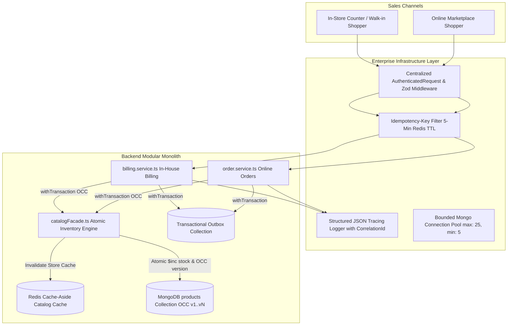
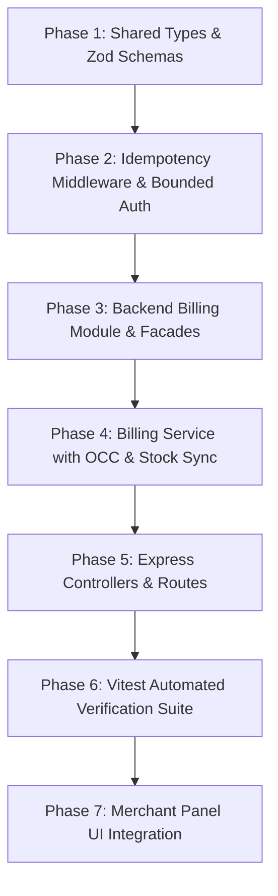

# 📐 Implementation Plan: In-House Retail Billing & Real-Time Inventory Sync Module (Enterprise Edition)

**Scope:** End-to-End Delivery of In-House Retail Billing & Point-of-Sale Module (`apps/backend/src/modules/billing/`) synchronized atomically with the Shared Catalog Inventory (`catalogFacade`), hardened with all of Rajesh's Enterprise Pillars from [`enterprise_catalog_order_architecture_updated(1).md`](file:///d:/UTKARSH/Live%20Projects/Vercel-live-Website/platform-root-vz/enterprise_catalog_order_architecture_updated(1).md), and wired to the Merchant Panel (`apps/merchant/src/pages/BillingPage.tsx`).  
**Design Reference:** `mockups/Merchant_Front/5.) Billing & Invoicing/` (`5.0.png` through `5.6.png` — 7 Mockups)  
**Target Milestone:** Tier 2 In-House Retail Billing & Enterprise Inventory Unification  
**Status:** READY FOR EXECUTION 🚀  

---

## 1. System Overview & Core Objectives

### 1.1 The Business Problem
Indian hyperlocal brick-and-mortar retailers manage two simultaneous sales channels:
1. **Walk-In Counter Shoppers:** Purchases billed at the counter by the shopkeeper or cashier.
2. **Online Marketplace Shoppers:** Orders placed by nearby customers via the customer web storefront.

Without a unified engine, selling the last 2 units of an item at the counter while an online shopper orders them creates **stock drift**, leading to cancelled online orders and angry customers.

### 1.2 The Architectural Solution
Build an **In-House Retail Billing & Quotations Module** in the backend that:
* Serves as a full-featured Point-of-Sale (POS) and invoicing engine for walk-in counter sales.
* **Draws directly from the single shared catalog inventory** via `catalogFacade.deductStock()` within ACID transactions.
* Immediately reflects stock reductions in real-time across both counter lookups and customer web browsing.
* Fully supports the 7 screens designed by Harish (`5.0` to `5.6`), including Invoices, Quotes/Estimates, Payment Tracking, and GST Configuration.
* **Embeds all 7 of Rajesh's Enterprise Pillars** for production reliability.



---

## 2. Invariants & Enterprise Non-Negotiables (Covering All Rajesh's Points)

| # | Rajesh's Enterprise Pillar | Technical Architecture in Implementation |
|---|---|---|
| **1** | **Optimistic Concurrency Control (OCC) & ABA Problem Elimination** | • All core entities (`Invoice`, `Quote`, `Product`, `Order`, `BillingSettings`) have explicit numeric `version: { type: Number, required: true, default: 1, min: 1, index: true }`.<br>• Mutations use atomic conditional matching: `findOneAndUpdate({ _id, version: expectedVersion }, { ..., $inc: { version: 1 } })`.<br>• **ABA Problem Resolution:** The classic ABA flaw occurs when states cycle (e.g., A ➔ B ➔ A) causing naive equality checks to miss concurrent updates. By using a **strictly monotonically increasing integer counter** (`1 ➔ 2 ➔ 3`), version values are NEVER reused or cycled back. Any loser of a race receives a `409 Conflict` (`CONCURRENT_MODIFICATION_ERROR`) and must re-read. |
| **2** | **Idempotency-Key Engine (Orders & Billing Module)** | • Implemented via reusable `idempotency.middleware.ts` for all mutation creation endpoints (`POST /api/v1/billing/invoices`, `POST /api/v1/orders`).<br>• Composite cache key: `idemp:${scopeId}:${operation}:${headerKey}` stored in Redis with 5-minute TTL.<br>• Stores SHA-256 request payload hash and cached HTTP response. If a cashier double-clicks or mobile network retries packet, the second request safely replays the existing invoice without duplicate billing or double stock deduction.<br>• *Relevance for Catalog:* Standard product updates (`PUT /products/:id`) use OCC version-matching which is naturally idempotent; product creates enforce unique slug/SKU. |
| **3** | **Generalized Typed Auth & Validation (`req.user` & `req.body`)** | • Uses `AuthenticatedRequest<TBody, TParams, TQuery>` across all controllers. Zero `(req as any)` casting.<br>• Route-level middleware (`validateBody`, `validateQuery`, `validateParams`) handles 100% of input validation before controllers execute.<br>• Controllers remain strictly **thin**: zero inline parameter checking, zero direct DB queries, zero business concurrency logic. |
| **4** | **Redis Cache-Aside Pattern for Catalog** | • Catalog read queries inspect Redis key `catalog:store:${storeId}` and `catalog:product:${id}` before querying MongoDB.<br>• **Redis is NEVER inventory truth**: MongoDB conditional atomic update (`{ 'variants.stock': { $gte: quantity } }` with `$inc: -quantity`) is the sole inventory authority.<br>• Immediate cache invalidation on any counter invoice issuance, online checkout, or product update. |
| **5** | **Structured Observability & JSON Tracing Logger** | • Winston structured JSON logger recording: `{ timestamp, level, event, correlationId, storeId, invoiceId, itemsCount, durationMs }` on all critical operational steps.<br>• Never use `console.log`. Never swallow database/Redis errors as 404s. |
| **6** | **Bounded Database Connection Pool** | • Explicit pool configuration in `connection.ts`: `maxPoolSize: 25`, `minPoolSize: 5`, `waitQueueTimeoutMS: 5000`, `socketTimeoutMS: 30000`.<br>• Prevents connection explosion under concurrent counter and web traffic. |
| **7** | **Modular Monolith, Facades & Transactional Outbox** | • Strict module boundaries: `billing` accesses catalog solely via `catalogFacade`.<br>• Stock items sorted deterministically before deduction to avoid database deadlocks.<br>• Domain events (`INVOICE_ISSUED`, `INVOICE_PAID`, `INVOICE_CANCELLED`) written to Transactional Outbox inside the same `withTransaction` session. |

---

## 3. Visual Audit of Harish's Billing Mockups (`mockups/Merchant_Front/5.) Billing & Invoicing`)

| Mockup | View / Screen | Key Functional UI Elements | Backend API & Services Required |
|---|---|---|---|
| `5.0.png` | **Invoices Dashboard** | • 5 KPI Cards: Total Invoices, Total Sales (₹), Paid (₹), Outstanding (₹), Overdue (₹)<br>• 7 Status Tabs: All Invoices (1248), Draft, Issued, Paid, Partially Paid, Overdue, Cancelled<br>• Search & Filter Toolbar: Date picker, Customer search, Payment mode filter<br>• Primary Action: `+ Create Invoice` button | • `GET /api/v1/billing/invoices`<br>• Aggregation pipeline returning paginated invoices + 5 computed KPI summaries in a single round-trip |
| `5.1.png` | **Invoice Row Actions Menu** | • 8 Row Actions: Download PDF, Open, Duplicate Invoice, Record Payment, View Payments, Notes, Adjust Invoice, Cancel Invoice | • `GET /api/v1/billing/invoices/:id`<br>• `POST /api/v1/billing/invoices/:id/duplicate`<br>• `PATCH /api/v1/billing/invoices/:id/cancel` |
| `5.2.png` | **Create Invoice Modal (2-Column Form)** | • Left Column: Customer name, phone, email, billing address, GSTIN, Place of Supply<br>• Right Column: Product picker table (Item, HSN, Qty, Unit, Rate, Discount, Tax %, Total), Tax summary breakdown (CGST, SGST, IGST, Round Off, Grand Total)<br>• Footer: Payment status selector, Settlement mode (Cash, UPI, Card, Net Banking), `Save as Draft`, `Create Invoice & Print` | • `POST /api/v1/billing/invoices`<br>• GST calculation engine (Intra-state vs Inter-state)<br>• `catalogFacade.deductStock()` within ACID transaction<br>• Redis cache invalidation |
| `5.3.png` | **Billing & Invoicing Settings** | • Invoice Prefix (`INV-`), Starting Number (`1249`)<br>• Quote Prefix (`Q-`), Starting Number (`1026`)<br>• GST Toggle, Default GST Rate, Tax Mode (Inclusive / Exclusive)<br>• Discount caps (max 20%), Default Terms & Conditions<br>• Live A4 Preview Pane | • `GET /api/v1/billing/settings`<br>• `PUT /api/v1/billing/settings`<br>• Sequential atomic numbering engine |
| `5.4.png` | **More Actions Dropdown** | • Bulk Import Invoices (CSV)<br>• Export Invoices (Excel / CSV)<br>• Download Sales Tax Report (GSTR-1 format)<br>• Link to Estimates & Quotes Table | • `GET /api/v1/billing/invoices/export`<br>• `GET /api/v1/billing/invoices/tax-report` |
| `5.5.png` | **Estimates / Quotes Table** | • 5 KPI Cards: Total Quotes, Total Value, Accepted, Converted, Expired<br>• Quotes List Table with Customer, Date, Valid Until, Total, Status<br>• Row Action: `🔄 Convert to Invoice` | • `GET /api/v1/billing/quotes`<br>• `POST /api/v1/billing/quotes/:id/convert`<br>• `PATCH /api/v1/billing/quotes/:id/status` |
| `5.6.png` | **Create Estimate / Quote Form** | • Customer Details, Quote #, Valid Until date picker, Reference / PO #<br>• Line items table with pricing and taxes<br>• Customizable Terms & Conditions clauses | • `POST /api/v1/billing/quotes` |

---

## 4. Data Models & Database Schemas (`apps/backend/src/modules/billing/billing.model.ts`)

### 4.1 `InvoiceModel` (`invoices` Collection)
```typescript
export interface IInvoiceItem {
  productId?: mongoose.Types.ObjectId;  // Catalog product reference
  variantId?: string;                   // SKU variant identifier
  title: string;
  hsnCode: string;
  quantity: number;
  unit: 'Pcs' | 'Pair' | 'Kg' | 'Mtr' | 'Box';
  unitPrice: number;                   // Base price
  discountAmount: number;
  taxableAmount: number;
  taxRate: number;                     // 0, 5, 12, 18, 28%
  cgst: number;
  sgst: number;
  igst: number;
  totalAmount: number;
}

export interface IInvoiceDocument extends mongoose.Document {
  storeId: mongoose.Types.ObjectId;
  invoiceNumber: string;               // e.g. "INV-1248" (unique per store)
  type: 'TAX_INVOICE' | 'RETAIL_BILL' | 'PROFORMA';
  idempotencyKey?: string;
  customer: {
    name: string;
    phone: string;
    email?: string;
    billingAddress?: string;
    state: string;
    gstin?: string;
  };
  items: IInvoiceItem[];
  pricing: {
    subTotal: number;
    totalDiscount: number;
    taxableAmount: number;
    cgstTotal: number;
    sgstTotal: number;
    igstTotal: number;
    roundOff: number;
    grandTotal: number;
  };
  payment: {
    status: 'DRAFT' | 'ISSUED' | 'PAID' | 'PARTIALLY_PAID' | 'OVERDUE' | 'CANCELLED';
    paidAmount: number;
    dueAmount: number;
    settlementMode: 'CASH' | 'UPI' | 'CARD' | 'NET_BANKING' | 'SPLIT';
    paymentDate: Date;
    paymentHistory: Array<{
      amount: number;
      mode: string;
      date: Date;
      reference?: string;
      recordedBy?: string;
    }>;
  };
  dates: {
    invoiceDate: Date;
    dueDate: Date;
  };
  placeOfSupply: string;
  paymentTerms?: string;
  notes?: string;
  isInventoryDeducted: boolean;        // Guard against duplicate stock operations
  version: number;                     // Monotonic OCC Version Counter (Pillar 1)
  createdAt: Date;
  updatedAt: Date;
}
```

**Indexes:**
* `{ storeId: 1, invoiceNumber: 1 }` (unique)
* `{ storeId: 1, 'payment.status': 1, createdAt: -1 }`
* `{ storeId: 1, 'dates.invoiceDate': -1 }`
* `{ idempotencyKey: 1 }` (sparse)

---

## 5. Implementation Roadmap & Execution Sequence



### Phase 1: Shared Types & Zod Schemas
1. Create `packages/shared-types/src/billing.types.ts`:
   - Enums: `InvoiceStatus`, `InvoiceType`, `SettlementMode`, `QuoteStatus`.
   - Zod schemas: `CreateInvoiceSchema`, `RecordPaymentSchema`, `CreateQuoteSchema`, `BillingSettingsSchema`.
2. Export from `packages/shared-types/src/index.ts`.

### Phase 2: Idempotency Middleware (`apps/backend/src/shared/middlewares/idempotency.middleware.ts`)
1. Implement Redis-backed idempotency filter with 5-minute TTL.
2. Verify payload hash matching to reject conflicting retries.
3. Wire into billing and orders creation routes.

### Phase 3: Backend Billing Schemas & Outbox Integration
1. Implement `apps/backend/src/modules/billing/billing.model.ts` with strict Mongoose schemas, compound indexes, and numeric `version: 1`.
2. Implement `apps/backend/src/modules/billing/billing.validation.ts` mapping Zod contracts.

### Phase 4: Core Service & Inventory Synchronization (`billing.service.ts`)
1. **GST Calculation Engine**: Computes intra-state CGST+SGST vs. inter-state IGST with round-off.
2. **Sequential Numbering**: Atomic counter increment on `BillingSettingsModel.nextInvoiceNumber`.
3. **Atomic Inventory Sync**:
   - Calls `catalogFacade.deductStock()` inside `withTransaction(session)`.
   - Sets `isInventoryDeducted = true`.
   - On cancellation: calls `catalogFacade.restoreStock()`.
   - Triggers `invalidateCache('catalog:store:*')` on success.
4. **Outbox Events**: Records `INVOICE_ISSUED`, `INVOICE_PAID`, `INVOICE_CANCELLED` into Outbox collection in the same session.

### Phase 5: Thin Controllers & Routes
1. Create `billing.controller.ts` using `AuthenticatedRequest`.
2. Mount routes under `/api/v1/billing` in `apps/backend/src/app.ts`.

### Phase 6: Automated Vitest Test Suite
1. Create `apps/backend/src/modules/billing/__tests__/billing.test.ts`.
2. Verify:
   - Tax calculations (Intra-state vs Inter-state).
   - Sequential number generation.
   - Idempotency key short-circuiting.
   - Atomic inventory deduction & restoration.
   - OCC version increment and 409 conflict detection.
   - Quote to invoice conversion.

### Phase 7: Merchant Panel UI Wiring (`apps/merchant`)
1. Connect `InvoicesTableView.tsx`, `QuotesTableView.tsx`, `CreateInvoiceModal.tsx`, `BillingSettingsView.tsx` to `/api/v1/billing/*`.
2. Verify brand-agnostic design system adherence.

---

## 6. Definition of Done
1. **Tests:** All tests pass with 100% green status (`pnpm test`).
2. **Build:** Monorepo builds without TypeScript errors (`pnpm build`).
3. **Rajesh's Pillars:** OCC versioning, ABA elimination, Idempotency keys, typed AuthenticatedRequest, Redis catalog cache-aside, Winston logging, and bounded connection pool completely verified.
4. **Zero Brand Leaks:** 100% brand-agnostic code with `{branding.appName}` and generic IDs.
