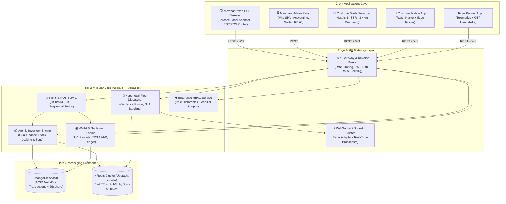
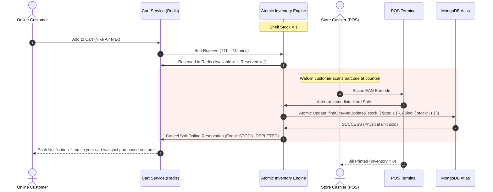
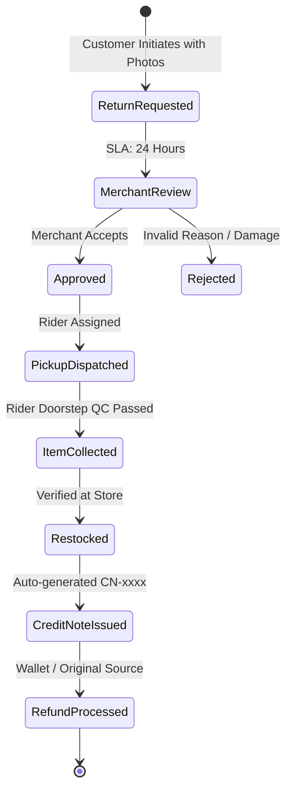
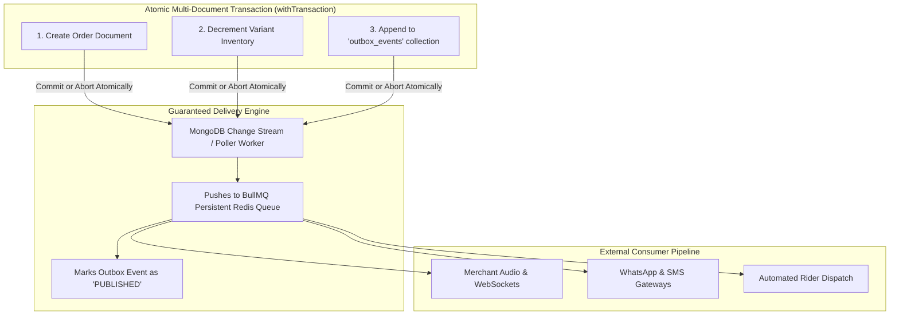
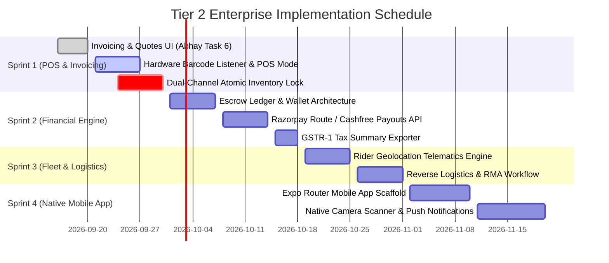

# 🏛️ TIER 2 ENTERPRISE ARCHITECTURE BLUEPRINT
## Hyperlocal Retail Operations, Dual-Channel POS Billing & Unified Fleet Ecosystem

**Platform:** White-Label Hyperlocal Multi-Vendor Platform  
**Target Release Horizon:** Post-Staging Gate / Phase 7 (Q4 2026)  
**Author:** Lead Full-Stack Architect / Antigravity AI  
**Status:** Canonical Architectural Blueprint  

---

## 1. Executive Summary & Strategic Context

### 1.1 The Business Reality: The "Hybrid Commerce" Dilemma
Client leadership envisions an ambitious hybrid system that cherry-picks high-value enterprise features from across the modern commerce landscape:
1. **Hyperlocal Food/QSR Dispatch (like Zomato/Swiggy)** — but applied to arbitrary physical retail (fashion, electronics, hardware, cosmetics).
2. **Same-Day / 2-Hour Delivery (like Blinkit/Zepto)** — but **without dark stores**, treating existing brick-and-mortar shops as physical fulfillment nodes.
3. **Comprehensive SKU Cataloging (like Amazon/Flipkart)** — multi-variant pricing, size/color matrices, rich attributes, customer reviews, and faceted filtering.
4. **Full Merchant Accounting & GST Compliance (like Zoho Books / Tally)** — Estimates/Quotes, Tax Invoices, Credit/Debit Notes, and GSTR-1 compliant tax ledgers.
5. **Physical POS Counter Billing (like D-Mart / Reliance Retail)** — high-speed USB/Bluetooth barcode laser scanning at the counter, syncing live with online marketplace stock.
6. **Unified Delivery Fleet Management** — merchant self-delivery option mixed with pooled platform delivery partners and 4-digit OTP delivery handoffs.

### 1.2 The Architectural Mandate
If engineered haphazardly, these six divergent requirements will cause fatal concurrency race conditions (e.g., a walk-in customer purchases the last t-shirt at the counter while an online user checks out the same item). 

**Tier 2 exists to solve this fundamentally:** building a resilient, event-driven distributed system where the physical counter and the online storefront act as two synchronized viewpoints over a single atomic source of truth.

---

## 2. Global Tier 2 Topology & Architecture



---

## 3. Deep-Dive: The 8 Enterprise Modules

### Module 1: Physical POS Counter Billing & Barcode Engine (Mockups 5.0–5.9)

#### A. Rapid Barcode Scanner Input Mode
* **Hardware Interop**: Support standard HID USB/Bluetooth laser scanners. Scanners emulate keyboard input ending with `Enter` (`\n`).
* **Input Buffer Listener**:
  A global listener captures keystroke bursts ($< 50\text{ms}$ between keystrokes indicates hardware barcode scan rather than human typing) and routes the scanned EAN-13/UPC barcode straight to the billing cart without requiring input field focus.
* **ESC/POS Direct Thermal Receipt Printing**:
  Generate raw ESC/POS byte commands for 80mm and 58mm thermal receipt printers over WebUSB or local network print spooler (`localhost:9100`), printing barcode receipts in $< 200\text{ms}$.

#### B. Accounting & Invoicing Topology
| Document Type | Prefix | Description & Lifecycle |
|---|:---:|---|
| **Tax Invoice** | `INV-` | Formal GST invoice with HSN/SAC breakdown, CGST+SGST or IGST, and customer GSTIN. |
| **Estimate / Quote** | `Q-` | Commercial quotation with validity timer; 1-click **Convert to Invoice** (`+ Convert`). |
| **Credit Note** | `CN-` | Issued against returns or pricing concessions; tracks used vs unused credit balance. |
| **Debit Note** | `DN-` | Issued for supplementary charges, price revisions, or vendor chargebacks. |

---

### Module 2: The Dual-Channel Concurrency & Inventory Lock Engine

The most critical technical challenge is the **physical vs digital race condition**:
```
Scenario: Only 1 unit of "Nike Air Max Size 9" remains on the store shelf.
14:02:10 — Customer A adds the shoes to their online cart on the web storefront.
14:02:25 — A walk-in customer brings the physical box to the cashier counter to pay.
```

#### The Two-Phase Reservation & Reconcile Algorithm


#### Atomic MongoDB Mutation Pattern:
```typescript
// Strict concurrency guard using atomic conditional decrement
export async function deductStockAtomic(
  storeId: string,
  productId: string,
  variantSku: string,
  quantity: number
): Promise<{ success: boolean; remainingStock: number }> {
  const result = await ProductModel.findOneAndUpdate(
    {
      storeId,
      'variants.sku': variantSku,
      'variants.stock': { $gte: quantity }, // GUARANTEE: Never oversell below 0
    },
    {
      $inc: { 'variants.$.stock': -quantity },
    },
    { new: true }
  );

  if (!result) {
    return { success: false, remainingStock: 0 };
  }

  const updatedVariant = result.variants.find((v) => v.sku === variantSku);
  const remainingStock = updatedVariant ? updatedVariant.stock : 0;

  // Broadcast live inventory update to all connected clients & POS terminals
  await redisPubSub.publish('INVENTORY_SYNC', JSON.stringify({
    storeId,
    productId,
    variantSku,
    remainingStock,
  }));

  return { success: true, remainingStock };
}
```

---

### Module 3: Merchant Financial Ledger, Escrow & Automated Payouts (Mockups 6.0–6.1)

#### A. The Escrow Financial Lifecycle
1. **Customer Payment Capture**: Online funds are collected into the platform escrow account via Payment Gateway (Razorpay/Cashfree).
2. **Delivery Handshake**: Funds remain in escrow until the customer delivers the **4-digit OTP** to the delivery rider.
3. **Escrow Release**: Upon `ORDER_DELIVERED`, the ledger creates an atomic credit entry to the merchant's live wallet.

#### B. Financial Ledger Ledger Entry Formula:
$$\text{Net Merchant Credit} = \text{Order Total} - \text{Platform Fee} - \text{TDS (1\% u/s 194-O)} - \text{Payment Gateway Charges}$$

```typescript
// Ledger transaction schema
export interface IWalletTransaction {
  id: string;
  storeId: string;
  orderId?: string;
  type: 'ORDER_CREDIT' | 'COMMISSION_DEBIT' | 'TDS_DEBIT' | 'PAYOUT_WITHDRAWAL' | 'REFUND_REVERSAL';
  grossAmount: number;
  platformFee: number;
  tdsAmount: number; // 1% under Section 194-O
  netAmount: number;
  balanceAfter: number;
  status: 'PENDING' | 'SETTLED' | 'HELD';
  settlementDate?: Date;
}
```

#### C. Automated Bank Settlements (T+1 / T+2 Rolling Window)
* Daily automated batch payout running at `02:00 UTC` via Razorpay Route or Cashfree Payouts API.
* Bank account verification via Penny-Drop API during onboarding ensures 0% payout failure rate.

---

### Module 4: Reverse Logistics, Returns & RMA Pipeline (Mockup 7.0)

#### A. 4-Stage Return State Machine


#### B. Automated Credit Note Issuance
* When an item is marked `Restocked`, the system automatically calls `billingService.createCreditNote()` matching Mockup `5.7.png`.
* The credit note is emailed to the customer and recorded in the merchant's GST tax ledger.

---

### Module 5: Hyperlocal Fleet Telematics & Rider Dispatch (Mockups 12.0–12.6)

#### A. The Two Fleet Models
1. **Self-Delivery Mode (Merchant's Own Staff)**:
   Store staff or local delivery boy handles delivery. Store owner assigns order to specific rider in `12.0.png`.
2. **Platform Pooled Fleet Mode**:
   Algorithmic broadcast to nearby registered delivery riders within a 3–4 km bounding box.

#### B. Real-Time Telematics & Fraud Prevention
* **High-Frequency GPS Pings**: Riders stream GPS coordinates every 5 seconds via WebSocket over Redis Geohash (`GEOADD riders:locations <lng> <lat> <riderId>`).
* **Customer Map Tracking**: Customer web and mobile clients listen to room `order:track:<id>` for live polyline updates.
* **4-Digit OTP Handshake**: Rider cannot mark an order `DELIVERED` without entering the customer's secret OTP. This eliminates delivery fraud and false delivery claims.

---

### Module 6: Enterprise Staff RBAC & Store Multi-Tenancy (Mockups 14.0–14.2)

To allow multiple employees to operate the store safely, the Merchant Panel enforces 4 granular roles:

| Role | Access Level | POS Billing | Catalog/Stock Edit | Financial Wallet & Payouts | Staff Management |
|---|---|:---:|:---:|:---:|:---:|
| **Store Owner** | Full Super-Admin | ✅ | ✅ | ✅ | ✅ |
| **Store Manager** | Operational Admin | ✅ | ✅ | ❌ (View Only) | ❌ |
| **Counter Cashier**| POS Billing Only | ✅ | ❌ (View Only) | ❌ | ❌ |
| **Stock Clerk / Picker** | Warehouse & Packing | ❌ | ✅ (Adjust Stock) | ❌ | ❌ |

#### Route & Mutation Guards:
Every controller endpoint checks permissions via a decorator middleware:
```typescript
router.post(
  '/payouts/withdraw',
  authenticateJwt,
  requirePermission('FINANCE:WITHDRAW'),
  payoutController.requestWithdrawal
);
```

---

### Module 7: Business Intelligence, Analytics & Tax Reports (Mockups 10.0–10.2, 15.0)

* **Real-Time KPI Aggregations**:
  - Hourly footfall vs. online traffic conversion rate.
  - GMV, Average Order Value (AOV), Return Rate percentage.
  - Fast-moving vs Dead-stock SKU warnings.
* **GSTR-1 Ready Tax Export**:
  - One-click CSV export structured according to GSTN schema (Table 4: B2B, Table 7: B2C Small, Table 12: HSN Summary).

---

### Module 8: Customer Native Mobile App (`apps/mobile`)

* **Framework**: React Native with **Expo Router** (file-based navigation matching Next.js 14).
* **Shared Logic**: Direct code reuse of Zustand stores (`authStore`, `cartStore`, `wishlistStore`) from `@repo/shared-types`.
* **Native Capabilities**:
  - Camera Barcode Scanner (for in-store self-checkout / price lookup).
  - Background GPS location updates for hyper-accurate local store radius detection.
  - Native Push Notifications (APNs for iOS, FCM for Android) for order status and flash sale alerts.

---

## 4. Distributed Systems Resilience, Transaction Management & High-Concurrency Engine

### 4.1 The CAP Theorem & Domain Consistency Partitioning

In a high-throughput, multi-vendor commerce platform, applying a single global consistency model across all domains is an anti-pattern:
* **Global Strong Consistency Everywhere**: Synchronizing consensus across primary database nodes for every catalog view, faceted filter count, rating query, and notification collapses throughput and degrades availability (CAP: pure CP).
* **Global Eventual Consistency Everywhere**: Asynchronous replication delays on stock balances or session states lead to catastrophic overselling (two customers checking out the last physical item) or revoked staff tokens continuing to approve orders.

#### The Architectural Bifurcation:
```
┌────────────────────────────────────────────────────────────────────────┐
│                   THE SYSTEM CONSISTENCY BIFURCATION                   │
├───────────────────────────────────┬────────────────────────────────────┤
│ 🔒 Strong Consistency (CP Tier)   │ ⚡ Eventual Consistency (AP Tier)  │
├───────────────────────────────────┼────────────────────────────────────┤
│ 1. Auth & Session Revocation      │ 1. Catalog Search & Faceted Filters│
│ 2. Orders & Payment State Machine │ 2. Product Ratings & Review Counts │
│ 3. Inventory Stock Allocation     │ 3. Asynchronous Notifications      │
│ 4. Financial Ledger & Wallet      │ 4. Rider GPS Polyline Telematics   │
│                                   │ 5. Analytics & KPI Aggregations    │
├───────────────────────────────────┼────────────────────────────────────┤
│ • Primary Node Routing Only       │ • Secondary Replica / Cache Reads  │
│ • writeConcern: { w: 'majority' } │ • readPreference: 'secondary'      │
│ • readConcern: 'majority'         │ • Causal Consistency Sessions      │
│ • Multi-Document ACID Transactions│ • Asynchronous Domain Events / Queue│
└───────────────────────────────────┴────────────────────────────────────┘
```

#### How MongoDB Provides Both Consistency Models:
MongoDB is a **Tunable Consistency Database**. Consistency is dynamically configured per-bounded-context using 4 primary levers:

| Lever | CP Configuration (Auth & Orders) | AP Configuration (Catalog & Notifications) |
|---|---|---|
| **`writeConcern`** | `{ w: 'majority', j: true }` — Quorum disk commit before return. | `{ w: 1 }` — Fast in-memory acknowledgment on primary. |
| **`readConcern`** | `'majority'` or `'linearizable'` — Zero dirty or rollback reads. | `'local'` or `'available'` — Maximum read throughput. |
| **`readPreference`** | `'primary'` — Read exclusively from single source of truth. | `'secondaryPreferred'` — Offload read load to replicas. |
| **Session Model** | Multi-Document ACID Transaction (`withTransaction`). | Causal Consistency Session (`afterClusterTime`). |

---

### 4.2 Modular Monolith ACID Transaction Management

Because our architecture is a **Modular Monolith** sharing a single MongoDB Atlas cluster (rather than physically isolated microservices), we avoid the high latency, distributed deadlocks, and complex compensating sagas of microservices. We execute **True ACID Multi-Document Transactions** across module boundaries without violating domain encapsulation.

```
                              HTTP / POS REQUEST
                                      │
                                      ▼
                        ┌───────────────────────────┐
                        │   Order Service           │
                        └─────────────┬─────────────┘
                                      │
                                      ▼
                      ┌───────────────────────────────┐
                      │    withTransaction(session)   │  ◄── Unit of Work / Session Manager
                      └───────┬───────────────┬───────┘
                              │               │
            ┌─────────────────┴───────┐       └────────────────────────┐
            ▼                         ▼                                ▼
┌───────────────────────┐ ┌─────────────────────────┐     ┌─────────────────────────┐
│ Order Module          │ │ Catalog Module (Facade) │     │ Billing Module (Facade) │
│ • Create Order Record │ │ • Atomic Stock Deduction│     │ • Create Pending Invoice│
│ (with session)        │ │ (with session)          │     │ (with session)          │
└───────────────────────┘ └─────────────────────────┘     └─────────────────────────┘
            │                         │                                │
            └─────────────────┬───────┴────────────────────────────────┘
                              │
                    [ All Succeeded? ]
                     ├── YES ──► COMMIT TRANSACTION
                     │                 │
                     │                 ▼
                     │     ┌────────────────────────┐
                     │     │ Post-Commit Hooks      │
                     │     │ • Emit BullMQ events   │ (WhatsApp, Push, Socket.io)
                     │     │ • Redis Cart Cleanup   │
                     │     └────────────────────────┘
                     │
                     └── NO ───► ROLLBACK & ABORT (Nothing touches DB)
```

#### A. The Transaction Runner (`withTransaction.ts`)
Wraps Mongoose sessions, sets read/write concerns, and transparently handles transient MongoDB replica set retryable errors:

```typescript
// apps/backend/src/shared/database/transaction.ts
import mongoose, { ClientSession } from 'mongoose';
import { logger } from '../utils/logger.js';

export interface TransactionOptions {
  session?: ClientSession;
}

export async function withTransaction<T>(
  work: (session: ClientSession) => Promise<T>,
  existingSession?: ClientSession
): Promise<T> {
  if (existingSession) {
    return work(existingSession); // Participate in existing session without nested commit
  }

  const session = await mongoose.startSession();
  try {
    let result: T;
    await session.withTransaction(async () => {
      result = await work(session);
    }, {
      readPreference: 'primary',
      readConcern: { level: 'local' },
      writeConcern: { w: 'majority' },
    });
    return result!;
  } catch (error) {
    logger.error('❌ Transaction aborted:', error);
    throw error;
  } finally {
    await session.endSession();
  }
}
```

#### B. Facade Session Propagation (Encapsulation Preserved)
Cross-module calls pass `{ session?: ClientSession }`. Models remain 100% private to their owning module:

```typescript
// apps/backend/src/modules/orders/order.service.ts
export async function createOrder(userId: string, dto: CreateOrderDTO) {
  const postCommitTasks: Array<() => Promise<void>> = [];

  const order = await withTransaction(async (session) => {
    // 1. Create order record
    const created = await repo.create(
      { userId, ...dto, shippingAddress: normalizeAddress(dto.shippingAddress) },
      { session }
    );

    // 2. Atomically reserve/deduct stock through Catalog Facade
    await catalogFacade.deductStock(
      dto.items.map(i => ({ productId: i.productId, sku: i.sku, quantity: i.quantity })),
      { session }
    );

    // 3. Create initial Merchant Invoice / Ledger entry
    await billingFacade.createOrderInvoice(created.id, dto.storeId, { session });

    // 4. Register post-commit event (NEVER run external APIs inside DB transactions!)
    postCommitTasks.push(async () => {
      await eventBus.emit(EVENTS.ORDER_PLACED, {
        orderId: created.id,
        orderNumber: created.orderNumber,
        userId: created.userId,
        storeId: created.storeId,
        grandTotal: created.grandTotal,
        itemsCount: created.items.length,
      });
    });

    return created;
  });

  // Execute post-commit side effects safely after durable commit
  for (const task of postCommitTasks) {
    task().catch(err => logger.error('Post-commit task failed:', err));
  }

  return order;
}
```

### 4.3 The Dual-Write Dilemma & Transactional Outbox Pattern

In distributed multi-vendor commerce, modifying the database and emitting an external message (WhatsApp, Redis, BullMQ) inside a single handler introduces the **Dual-Write Failure Mode**:
* **Database First, Message Fails**: The order is recorded in MongoDB, but the server crashes or network fails before the event publishes to BullMQ $\rightarrow$ the customer is charged, but merchant notifications and rider dispatch never fire.
* **Message First, Database Fails**: The notification is sent, but the database write throws a concurrency error or validation fault $\rightarrow$ the merchant/customer receives a confirmation for an order that does not exist in the database.

#### The Architecture Solution: Transactional Outbox
We eliminate this vulnerability by persisting outbound domain events into an `outbox_events` collection **within the exact same atomic MongoDB transaction session (`session`)** that records the order and deducts stock:



#### Outbox Event Schema:
```typescript
// apps/backend/src/shared/database/outbox.model.ts
import mongoose, { Schema, Document } from 'mongoose';

export interface IOutboxEvent extends Document {
  eventType: string;
  aggregateId: string;
  payload: Record<string, unknown>;
  status: 'PENDING' | 'PUBLISHED' | 'FAILED';
  attempts: number;
  createdAt: Date;
  publishedAt?: Date;
}

const outboxSchema = new Schema<IOutboxEvent>({
  eventType: { type: String, required: true, index: true },
  aggregateId: { type: String, required: true },
  payload: { type: Schema.Types.Mixed, required: true },
  status: { type: String, enum: ['PENDING', 'PUBLISHED', 'FAILED'], default: 'PENDING', index: true },
  attempts: { type: Number, default: 0 },
  createdAt: { type: Date, default: Date.now, index: true },
  publishedAt: { type: Date },
});

export const OutboxModel = mongoose.model<IOutboxEvent>('OutboxEvent', outboxSchema);
```

---

### 4.4 The Saga Pattern: Internal ACID vs. External Distributed Orchestration

When operations span boundaries where a single atomic database transaction cannot be held:

```
[Order Placed] ──► [Authorize Payment] ──► [Reserve Inventory] ──► [Assign Rider]
                         │ (Payment Failed)
                         ▼
             [COMPENSATING TRANSACTION]
             (Cancel Order & Release Inventory)
```

* **Internal Modules (Modular Monolith)**: Managed via **Local Multi-Document ACID Transactions (`withTransaction`)**. Zero Saga orchestration needed because all core domains (`auth`, `stores`, `catalog`, `orders`, `billing`) share the MongoDB Atlas cluster.
* **External Third-Party Handshakes (Payment Gateways & Telematics)**: Managed via an **Orchestrated Webhook Saga**:
  - Payment Webhook (`razorpay.payment.failed` / `order.timeout`) $\rightarrow$ executes a state machine transition to `CANCELLED` and triggers an automated compensating inventory increment (`incrementStockAtomic`).

---

### 4.5 Asynchronous Boundary Isolation & BullMQ Persistent Queueing

Relying exclusively on Node.js in-memory `EventEmitter` in production guarantees data loss:
1. **Server Restarts & Redeploys**: Unprocessed in-memory events in RAM are permanently lost.
2. **Third-Party API Outages**: A transient 503 from WhatsApp or SendGrid drops the notification with zero retries.
3. **Multi-Instance Scaling**: An in-memory event on Instance A never reaches a merchant WebSocket on Instance B.
4. **Event Loop Starvation**: Surges of 500 concurrent orders flood the event loop without backpressure.

#### Architectural Tiering: EventBus Interface ➔ BullMQ Persistent Transport
We preserve `eventBus.emit(...)` for clean developer ergonomics, but back all **Tier B (Mission-Critical)** events with **BullMQ + Redis**:

```
[Domain Service: Order / POS]
             │
             ▼
   eventBus.emit('ORDER_PLACED')   ◄── Clean domain facade
             │
             ▼
┌───────────────────────────────┐
│ EventBus Subscriber           │
│ (Pushes job to BullMQ queue)  │
└──────────────┬────────────────┘
               │
               ▼
┌───────────────────────────────┐
│ Redis / BullMQ Persistent Job │ ◄── Durable on disk; survives crashes
└──────────────┬────────────────┘
               │
      ┌────────┴────────┐
      ▼                 ▼
[Worker 1: SMS]   [Worker 2: GST Invoice]
• 5 retries       • Exponential backoff
• Dead-letter Q   • Rate-limited
```

#### Event Categorization Matrix:
| Category | Event Examples | Mechanism | Rationale |
|---|---|---|---|
| **Tier A: Ephemeral** | Cache bust (`CACHE_INVALIDATE`), local audit breadcrumbs | In-Memory `eventBus` | Non-critical; caches naturally expire via TTL. Zero overhead. |
| **Tier B: Mission-Critical** | `ORDER_PLACED`, `PAYMENT_CONFIRMED`, `REFUND_PROCESSED`, `INVOICE_GENERATED` | **BullMQ + Redis Queue** | Financial and customer-facing; requires guaranteed delivery, automatic retries, and persistence. |

---

### 4.6 Dead Letter Queue (DLQ) & Self-Healing Fault Tolerance

When external services (SMS gateway, GST portal, WhatsApp API) experience extended downtime, jobs that exhaust all 5 retries are routed to a dedicated **`platform-dead-letter-queue`**:

```
[Main Queue: 'order-notifications']
           │
  (Job fails 5 times with exponential backoff)
           │
           ▼
    worker.on('failed')
           │
           ▼
[Dedicated DLQ: 'platform-dead-letter-queue'] ──► [Alert: Sentry / Logs]
           │
   (External API Recovers)
           │
           ▼
    [Replay API: replayDeadLetterJobs()] ───────► Re-injects to Main Queue
```

#### A. Worker Failure Hook & DLQ Ingestion
```typescript
// apps/backend/src/shared/queues/order.worker.ts
orderWorker.on('failed', async (job: Job | undefined, err: Error) => {
  if (!job) return;

  if (job.attemptsMade >= (job.opts.attempts || 1)) {
    logger.error(`🚨 [DLQ Alert] Job ${job.id} (${job.name}) permanently failed after ${job.attemptsMade} attempts: ${err.message}`);

    // Push into the Dead Letter Queue with full diagnostic metadata
    await deadLetterQueue.add(`dlq-${job.name}`, {
      originalQueue: job.queueName,
      jobId: job.id,
      jobName: job.name,
      payload: job.data,
      error: { message: err.message, stack: err.stack },
      failedAt: new Date().toISOString(),
      attemptsMade: job.attemptsMade,
    });
  } else {
    logger.warn(`⚠️ [Retry Warning] Job ${job.id} attempt ${job.attemptsMade} failed. Backing off...`);
  }
});
```

#### B. Programmatic & Dashboard Replay Engine
```typescript
// apps/backend/src/shared/queues/dlqService.ts
export async function replayDeadLetterJobs(queueName = 'order-notifications', limit = 100): Promise<number> {
  const jobs = await deadLetterQueue.getJobs(['waiting', 'completed'], 0, limit);
  let replayedCount = 0;

  for (const job of jobs) {
    if (job.data.originalQueue === queueName) {
      await orderNotificationQueue.add(job.data.jobName, job.data.payload);
      await job.remove();
      replayedCount++;
    }
  }

  logger.info(`🔄 Replayed ${replayedCount} DLQ jobs back into ${queueName}`);
  return replayedCount;
}
```

#### C. Live Visual Administration with Bull Board
Mount `@bull-board/express` under an admin-authenticated route (`/api/v1/admin/queues`) providing real-time visibility over active jobs, waiting queues, failed states, and 1-click retry buttons.

---

### 4.7 Architectural Comparison: BullMQ vs. Apache Kafka

| Dimension | Apache Kafka (Streaming Log) | BullMQ + Redis (Job Queue) | Our Architectural Choice |
|---|---|---|---|
| **Primary Paradigm** | Immutable high-throughput event streaming log | Distributed stateful task & job queue | **BullMQ**: E-commerce workflows are asynchronous tasks (orders, bills, emails), not append-only analytics logs. |
| **Broker Engine** | Dedicated Kafka Brokers (JVM / KRaft / ZooKeeper) | **Redis Server** (C engine, in-memory, lightning fast) | **BullMQ**: Leverages the Redis cluster already powering our cart sessions and WebSockets. Zero added infra cost. |
| **Delayed / Scheduled Jobs** | ❌ Not supported natively (requires custom DB pollers) | ✅ Native 1-liner (`{ delay: 15 * 60 * 1000 }`) | **BullMQ**: Crucial for 15-minute auto-cancel of unassigned orders and rolling settlement batches. |
| **Per-Job Retries & Backoff** | ❌ Requires custom retry topics (`topic-retry-5s`) | ✅ Native per-job exponential backoff | **BullMQ**: Isolated retries without blocking or stalling other orders in the pipeline. |
| **Partitioning vs. Concurrency** | Physical topic partitions per key | Worker concurrency + Keyed Job Groups | **BullMQ**: Scales worker threads dynamically without re-sharding partitions. |
| **Clustering Support** | Kafka Cluster | **Redis Cluster** (`Redis.Cluster`) | **BullMQ**: Fully supports Redis Cluster sharding using hash tags (`{order-queue}`). |

---

### 4.8 Concurrency, Deadlocks, Query Optimization & Null Safety

#### A. Concurrency & Race Conditions:
* **The Counter-Store Collision**: Handled via MongoDB conditional updates (`{ 'variants.stock': { $gte: quantity } }`).
* **Deadlock Prevention (Sorted Resource Acquisition)**:
  When an order contains multiple SKUs, items are sorted alphabetically by SKU before acquiring locks:
  ```typescript
  dto.items.sort((a, b) => a.sku.localeCompare(b.sku));
  ```
  This eliminates circular wait conditions (Transaction 1 holding SKU-A waiting for SKU-B while Transaction 2 holds SKU-B waiting for SKU-A).

#### B. Database Scalability & Large Query Throughput:
* **Elimination of $N+1$ Queries**: Enforce `$in` batch queries across repositories.
* **Cursor Streaming for Massive Datasets**: For GSTR-1 CSV exports (10,000+ invoices) and bulk barcode generation, use Mongoose `.cursor()` streams:
  ```typescript
  const cursor = InvoiceModel.find({ storeId, date: { $gte: start, $lte: end } }).lean().cursor();
  for await (const doc of cursor) {
    csvStream.write(doc); // Constant memory consumption (< 30MB RAM)
  }
  ```
* **Keyset Pagination**: Replace expensive `.skip(10000)` with keyset cursors (`{ _id: { $lt: lastSeenId } }`) backed by indexed fields.
* **Lean Projections**: Every read-only query applies `.lean()` and explicit field `.select()` to avoid Mongoose document hydration overhead.

#### C. Exception & Null Safety:
* **Boundary Validation**: 100% of external inputs (REST, WebSockets, Environment variables) pass through strict Zod schemas.
* **Typed Domain Errors**: Global exception handler differentiates operational `AppError` (HTTP 400/404 with structured codes) from unhandled programmer crashes (HTTP 500 with stack traces logged to Sentry).

---

## 5. Technical Tradeoff Matrix: Tier 1 vs Tier 2

| Dimension | Tier 1 (Launch Scope - Current) | Tier 2 (Enterprise Scope - Roadmap) |
|---|---|---|
| **Inventory Source** | Online catalog drives stock | Unified Dual-Channel (POS counter + Web in sync) |
| **Billing Engine** | Standard digital order invoice | Full Commercial Invoicing, Quotes, Credit/Debit Notes |
| **Barcode Support** | Printable barcode labels generated | High-speed USB/Bluetooth hardware scanner input |
| **Financial Settlement** | Manual / Dashboard tracking | Automated Escrow, T+1 Rolling Bank Payouts, TDS 194-O |
| **Logistics Model** | Direct store delivery with OTP | Hybrid Fleet: Store Staff + Pooled Telematics Engine |
| **Location & Geocoding** | Free OpenStreetMap Nominatim + Durg/Bhilai/Raipur pre-cache | Commercial Google Maps Platform / Mapbox SDK + Live Places Autocomplete |
| **Rider Tracking** | Step-by-step order lifecycle statuses | Real-time 5s background GPS telematics + Live map rendering |
| **Geofencing & Delivery** | Fixed 3–4 km 2dsphere spatial radius | Dynamic polygon geofencing, route polylines & traffic-based ETA |
| **User Roles** | Single merchant owner login | Multi-user granular Staff RBAC (Cashier, Manager, Owner) |
| **Client Surfaces** | Customer Web + Merchant Panel | Web + Merchant Panel + Native Mobile App + POS Mode |
| **Transactions & Queues**| In-memory EventBus + Atomic Updates | Multi-Doc ACID Transactions + BullMQ Persistent Queue + DLQ |

---

### 5.1 Advanced Geolocation & Telematics Pipeline (Tier 2 Roadmap)
Following the initial launch in the **Durg, Bhilai, and Raipur** retail merchant ecosystem:
1. **Commercial Map Provider Integration**:
   - Upgrade from lightweight Nominatim / client lookup to Google Maps Platform / Mapbox SDK.
   - Places Autocomplete with predictive keystroke debounce and session token optimization to reduce API billing.
2. **Real-Time Rider Telematics (WebSocket + Redis Geospatial)**:
   - Dedicated rider tracking background service streaming continuous coordinates every 5 seconds.
   - Redis `GEOADD` and `GEORADIUS` caching layer for low-latency rider position queries.
3. **Dynamic Geofence Polygon Routing**:
   - Custom merchant delivery boundary polygons (replacing strict circular radii) respecting physical barriers like railway crossings and rivers in the Durg-Bhilai-Raipur twin-city zone.
   - Traffic-aware real-time ETA engine displaying live arrival minutes on the customer order tracking view.

---

## 6. Phased Implementation Roadmap (Post-Staging)



---

## 7. Engineering Invariants & Delegation Boundaries

1. **Intern Scoping vs Lead Architect Ownership**:
   - **Interns (Abhay & Vinay)**: Build UI component trees, forms, modal dialogs, data tables, and client-side formatting based on reference mockups (`apps/merchant/` and `apps/web/`).
   - **Lead Architect**: Owns the distributed transactions, atomic inventory decrement locks, Redis pub/sub clusters, payment gateway escrow webhooks, and security middleware.
2. **White-Label Strictness**:
   - The entire billing, POS, and financial infrastructure must remain 100% white-label. No client brand names (`Viztore`, `VZT`) in invoice generators, ESC/POS templates, or database collections.
3. **Database Performance Indexing**:
   - Compulsory compound indexes on `[storeId, 'variants.sku']` and `[storeId, 'status', 'createdAt']` to guarantee $< 15\text{ms}$ query response times during peak counter checkout.

