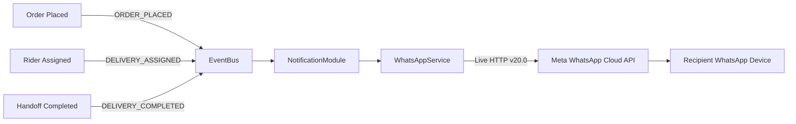

# Meta WhatsApp Cloud API — Production Transition & Operations Guide

> **Scope**: End-to-End guide to transitioning from Meta Developer Sandbox to Live Production Mode for unrestricted outbound WhatsApp notifications (Customers, Merchants & Delivery Riders).

---

## 1. Executive Architecture & Evolution

In this platform, WhatsApp notifications are integrated into the modular domain event bus (`eventBus`):



### Sandbox vs. Production Matrix

| Dimension | 🟡 Sandbox Mode (Current Test State) | 🟢 Live Production Mode (Target) |
|---|---|---|
| **Sender Number** | Meta Test Number (`+1 555-xxx-xxxx`) | Your Dedicated Indian Business SIM / Number |
| **Recipient Whitelist** | **Mandatory** (Max 5 verified numbers) | **Zero Restrictions** (Delivers to any number globally) |
| **Error `#131030`** | Triggers for any unlisted recipient | **Never triggers** |
| **Token Validity** | 24 Hours (Temporary User Token) | **Permanent** (Meta System User Token) |
| **Daily Message Volume** | ~50 test messages / day | Tier 1: 1,000 / day ➔ Tier 2: 10,000 / day ➔ Unlimited |

---

## 2. Prerequisites Checklist

Before beginning the migration, prepare:

- [ ] **A Dedicated Phone Number**: A 10-digit Indian SIM card or virtual number capable of receiving an SMS or voice OTP.
  > [!IMPORTANT]
  > This number **cannot** be currently registered on the personal WhatsApp or WhatsApp Business mobile app.  
  > *If it is active on a phone:* Open WhatsApp on that phone ➔ **Settings** ➔ **Account** ➔ **Delete Account** so Meta Cloud API can bind to it.
- [ ] **Meta Business Suite Account**: Admin access to [business.facebook.com](https://business.facebook.com/).
- [ ] **Payment Method**: A Credit/Debit card with international/online transactions enabled for Meta messaging fees.
- [ ] **Live Web URLs**:
  - Privacy Policy: `https://<your-domain>/account/privacy`
  - Terms of Service: `https://<your-domain>/account/terms`

---

## 3. Step-by-Step Production Migration

### Step 1: Add & Verify Your Real Business Phone Number

1. Navigate to **[developers.facebook.com](https://developers.facebook.com/)** and select your WhatsApp App.
2. In the left navigation menu, click **WhatsApp** ➔ **API Setup**.
3. Scroll down to **"Step 5: Add a phone number"** and click **Add phone number**.
4. Enter your public profile details:
   - **WhatsApp Business Display Name**: Your brand or marketplace name (e.g. `LocalStore Express`).
   - **Category**: Select **Shopping & Retail**.
   - **Timezone**: Select **(GMT+05:30) India Standard Time (Asia/Kolkata)**.
   - **Business Description**: (Optional) Hyperlocal retail store network.
5. Enter your dedicated phone number (e.g. `+91 98765 43210`).
6. Select verification method (**Text Message / SMS** or **Phone Call**) ➔ Enter the 6-digit verification code.
7. Upon successful verification, Meta assigns a new **Phone Number ID**.  
   *Note down this ID — it replaces the sandbox Phone Number ID in `.env`.*

---

### Step 2: Add a Payment Method in Meta Business Suite

Meta requires a payment method on file to dispatch outbound messages to non-whitelisted numbers:

1. Open **[business.facebook.com/billing](https://business.facebook.com/billing)**.
2. Select your business portfolio.
3. Click **Billing & Payments** ➔ **Payment Methods** ➔ **Add Payment Method**.
4. Enter your card details.
5. In **WhatsApp Manager** (`business.facebook.com/wa/manage/home/`):
   - Click **Phone Numbers** in the left menu.
   - Ensure the newly added number has **Payment Method: Configured / Linked**.

> [!TIP]
> **Pricing in India**: Meta charges on a per-conversation basis (24-hour window).  
> - **Utility conversations** (Order confirmations, OTPs, delivery updates): ~**₹0.12 to ₹0.30 per conversation**.  
> - Service conversations (customer messages first): Free within the 24h window.

---

### Step 3: Generate a Permanent System User Token (Never Expires)

The temporary access token in the developer dashboard expires every **24 hours**. For a production backend service, you must generate a **Permanent System User Token**:

1. Go to **[business.facebook.com/settings](https://business.facebook.com/settings)** (Meta Business Settings).
2. Under **Users** in the left sidebar, click **System Users**.
3. Click **Add**:
   - **System User Name**: `backend-notification-bot`
   - **System User Role**: `Admin`
   - Click **Create System User**.
4. In the system user panel, click **Assign Assets**:
   - Select **Apps** ➔ Choose your WhatsApp App ➔ Toggle **Manage App (Full Control)** ➔ Click **Save Changes**.
5. Click **Generate New Token**:
   - Select your App from the dropdown.
   - **Token Expiration**: Select **Never** (Permanent).
   - Under Available Permissions, check:
     - `whatsapp_business_messaging` (Required for sending messages)
     - `whatsapp_business_management` (Required for managing templates & WABA)
6. Click **Generate Token**.
7. **Copy and safely store** the generated access token (`EAAP...`). *(Meta will only display this token once).*

---

### Step 4: Toggle App Mode from "Development" to "Live"

1. Go to the top header bar of **[developers.facebook.com](https://developers.facebook.com/)**.
2. Locate the toggle switch: **`App Mode: Development`**.
3. Toggle the switch to **`Live`**.
4. If prompted:
   - **Privacy Policy URL**: Enter your live privacy URL (`https://<domain>/account/privacy`).
   - **Category**: Select **Business and Pages** or **Shopping**.
   - Click **Save Changes**.

---

### Step 5: Update Platform Environment Variables

Update your local `.env` as well as your staging/production cloud configuration (Render, Railway, or Docker):

```env
# ==============================================================================
# Meta WhatsApp Cloud API — Production Configuration
# ==============================================================================
WHATSAPP_PHONE_NUMBER_ID=1390494190808450       # Replace with Step 1 New Phone Number ID
WHATSAPP_ACCESS_TOKEN=EAAPjScnqKIUBS...          # Replace with Step 3 Permanent System User Token
WHATSAPP_BUSINESS_ACCOUNT_ID=2043458636342302   # Your WABA ID
WHATSAPP_API_VERSION=v20.0                      # Meta Graph API version
```

---

## 4. Verification & Testing via Platform CLI

Once the production credentials are in place, test outbound dispatches to **any phone number** without whitelisting:

### 1. Test Diagnostic System Ping
```bash
pnpm test:whatsapp 8109147565
```

### 2. Test Full Order Confirmation (with 4-Digit Delivery OTP)
```bash
pnpm test:whatsapp 8109147565 order
```

### 3. Test Rider Dispatch Manifest (with Google Maps Route)
```bash
pnpm test:whatsapp 8109147565 rider
```

### 4. Test Out-For-Delivery Notice
```bash
pnpm test:whatsapp 8109147565 out-for-delivery
```

### 5. Test Delivery Completed Receipt
```bash
pnpm test:whatsapp 8109147565 delivered
```

---

## 5. Meta 24-Hour Messaging Window & Template Guidelines

Meta enforces anti-spam rules on production WhatsApp numbers:

1. **User-Initiated (Customer messages your store first)**:
   - When a customer sends a message to your WhatsApp number, a **24-hour customer care session** opens.
   - During this window, your platform can send standard text messages, order summaries, and custom responses freely.

2. **Business-Initiated (Platform sends notifications out of the blue)**:
   - If messaging outside an active 24-hour customer session, Meta requires messages to follow an **Approved Message Template** (Category: *Utility*).
   - Creating a template takes 2 minutes in **WhatsApp Manager ➔ Message Templates** and approval typically takes **5–15 minutes**.
   - Standard Utility Template parameters:
     - Header: `Order Confirmed: {{1}}`
     - Body: `Your order for {{2}} items totaling ₹{{3}} has been received. Your delivery OTP is {{4}}.`

---

## 6. Built-In Zero-Cost Fallback: 1-Click WhatsApp Deep Links

If your Meta API token expires, account verification is pending, or you prefer zero messaging fees:

- The Merchant Management Panel (`apps/merchant`) includes an **integrated 1-click WhatsApp Dispatch link**:
  ```text
  https://wa.me/<rider_phone>?text=<encoded_order_manifest>
  ```
- When a merchant clicks **"Dispatch Delivery Rider"** in the order drawer:
  1. Opens WhatsApp Web or WhatsApp Mobile instantly.
  2. Pre-fills the entire manifest: Store pickup pin, customer drop address, item count, COD/Prepaid amount, and 4-digit Delivery OTP.
  3. Dispatches directly with **zero Meta API usage and zero verification requirements**.

---

## 7. Troubleshooting & Error Codes Reference

| Error Code | Meaning | Root Cause & Resolution |
|---|---|---|
| **`#131030`** | *Recipient phone number not in allowed list* | App is in **Development Mode**. Follow Step 4 to switch to **Live Mode**, or add the number to the test whitelist. |
| **`#190`** | *Access token expired / Invalid OAuth access token* | The temporary 24h developer token expired. Follow Step 3 to generate a **Permanent System User Token**. |
| **`#131047`** | *Re-engagement message* | Attempted to send a standard text message outside the 24-hour service window. Submit and use an approved Utility Template. |
| **`#100`** | *Invalid parameter / phone format* | Phone number format is invalid. The platform's `normalizePhoneNumber()` utility automatically strips special characters and formats Indian numbers (`91...`). |
| **`#131031`** | *Account has been restricted or deleted* | The WhatsApp Business Account has billing or policy issues. Check **Meta Business Manager ➔ Account Quality**. |

---

## 8. Summary Checklist for Launch Day

- [x] Backend WhatsApp notification service implemented (`whatsapp.service.ts`)
- [x] Event bus wired to `ORDER_PLACED`, `DELIVERY_ASSIGNED`, `DELIVERY_COMPLETED`
- [x] Dedicated CLI tester script available (`pnpm test:whatsapp`)
- [x] Zero hardcoded brand names — fully white-label (`branding.appName`)
- [ ] Add dedicated business phone number in WhatsApp Manager
- [ ] Link payment method in Meta Business Suite
- [ ] Generate Permanent System User Token
- [ ] Toggle App Mode to **Live**
- [ ] Update production `.env` with live credentials
