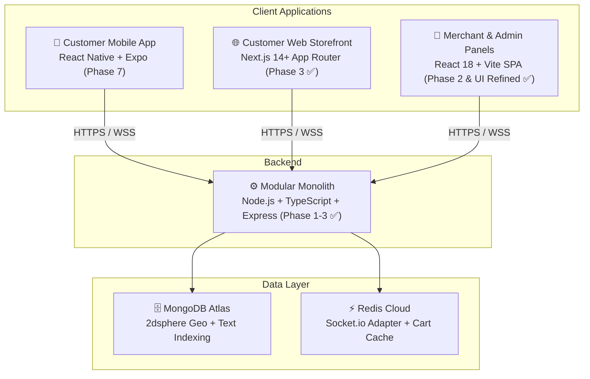

# Viztore Platform — Progress Tracker & Roadmap

## 1. Project Overview

**Viztore** is a **hyperlocal multi-vendor e-commerce platform** (3–4 km radius) designed to help **Indian local retailers** digitize their brick-and-mortar shops and make their products discoverable online.

> *"Built for Local Businesses. Made for India."*

## 2. Global Project Completion Status

### 🚀 Production Launch Scope (Phases 1–6: Backend + Merchant + Web + Ops)
`[████████████████████████████████░░░░░░░░░░] 81% Complete`

| Scope Dimension | Weight | Progress Bar | % Complete | Status | Target Milestone |
|---|:---:|---|:---:|:---:|---|
| **Overall Production Launch** (Phases 1–6) | **100%** | `[████████████████░░░░]` | **81%** | 🟡 Active Engineering | Staging & Production Go-Live |
| ↳ **Backend Architecture & APIs** | 30% | `[██████████████████░░]` | **92%** | 🟢 Complete / Hardened | 62/62 Tests Passing, Facades Live |
| ↳ **Merchant & Admin Panel** | 25% | `[██████████████████░░]` | **90%** | 🟢 Suite Complete | Inventory Suite & Onboarding Delivered |
| ↳ **Customer Web Storefront** | 25% | `[███████████████░░░░░]` | **75%** | 🟡 Live Wired | Address Book & Orders API Connected |
| ↳ **Production Readiness & DevOps** | 20% | `[████████████░░░░░░░░]` | **60%** | 🟡 Infrastructure Ready | Verified Atlas & Cloudinary Live |
| **Total Full-Platform Scope** (Phases 1–7) | — | `[██████████████░░░░░░]` | **69%** | ⚪ Roadmap Reserved | Customer Mobile App (Phase 7) |

> **Auto-Update Invariant**: This progress bar is recalculated and updated dynamically on every task assignment, milestone delivery, and PR merge per `.agents/rules/progress-tracking.md`.

---

## 3. Active Release Milestone: Staging Deployment & QA Release Gate
> **Target Release Date:** September 22, 2026  
> **Objective:** Deliver fully integrated, data-seeded staging environments to the QA team for end-to-end regression and exploratory testing.

| Sprint Window | Track & Focus Area | Macro Phase Link | Deliverables & Exit Criteria | Status |
|---|---|:---:|---|:---:|
| **Sept 15 – 16** | **Core Backend Completion** | Phase 6 | • Customer Address CRUD (`/api/v1/users/addresses`) • Order History API (`/api/v1/orders/my-orders`) • Store Rating & Aggregate Score (`/api/v1/stores/:id/rating`) | ✅ Completed |
| **Sept 17 – 18** | **Frontend Integration & Inventory Suite** | Phase 4 & 5 | • Inventory Management Suite (Mockups 4.0–4.6) • Wire Live Address Book & Orders APIs in Storefront • Full monorepo clean build & 62/62 unit tests passing | ✅ Completed Ahead of Schedule |
| **Sept 19 – 20** | **Cloud Staging Deployment** | DevOps | • Deploy `apps/backend` + Redis to Railway/Render • Deploy `apps/web` & `apps/merchant` to Vercel • Execute `pnpm seed:staging` (4 stores, 60+ products, test personas) | ⏳ Scheduled Next |
| **Sept 21 – 22** | **Smoke Testing & QA Handoff** | Quality Gate | • Execute full end-to-end purchase & OTP delivery handshake • Publish `QA_TESTING_GUIDE.md` with credentials & test scenarios • Formal release gate handover to the QA testing team | ⏳ Scheduled |

---

## 4. System Topology

---

## 5. Current Monorepo Status

| Layer | Technology | Status | Details |
|---|---|---|---|
| **Backend API** | Node.js v20+, Express, Mongoose, TypeScript | **Live & In Sync** ✅ | Auth, Stores, Onboarding, Catalog, Orders, Delivery, Notifications, Ratings, Addresses modules; /healthz & /readyz probes active |
| **Merchant Panel** | React 18, Vite, Tailwind CSS, Zustand | **Refined & Onboarding Merged** ✅ | Pixel-perfect Dashboard, 4 side drawers, 8-Tab Orders Pipeline, Product Cataloging, & Seller Onboarding Wizard (PR #5) |
| **Customer Storefront** | Next.js 14 App Router, Tailwind, TanStack Query | **Live** ✅ | Home feed, Stores directory, PLP, PDP, Category browse |
| **Shared Types** | TypeScript, Zod | **100% In Sync** ✅ | All contracts, validation schemas, DTOs (`structure.md`), branding config |
| **Real-Time & Events** | Socket.io + Redis Adapter + TypedEventBus | **Wired** ✅ | In-process domain events forwarded to Socket.io rooms with Redis distributed scaling |
| **Agent Workflows** | Custom Skills & Rules | **Active** ✅ | Fullstack Feature Workflow, UI Matching, Intern Delegation, /create-task |
| **Test Suite** | Vitest | **62/62 Passing** ✅ | 12 test suites (AppError, Auth/Addresses, Stores/Ratings, Onboarding, Catalog, Orders, Delivery, Notifications, WorkerPool, Cache-Aside) |
| **Build Status** | Turborepo | **Clean** ✅ | Full monorepo builds with zero errors across all 5 packages |
| **Engineering Standards** | 8/8 Pillars (`structure.md`) | **100% Implemented** ✅ | Facades, Composition roots, 3-tier testing, EventBus, WorkerPool, Cache-Aside + Replica split, ESR indexing, Decoupled repos |

---

## 6. Phase-by-Phase Roadmap & Progress

### 🔵 Phase 1 — Foundation & Core Backend (COMPLETED ✅)
> *Modular monolith architecture with authentication and spatial store queries*

- [x] Monorepo scaffolding with pnpm workspaces and Turborepo
- [x] `shared/` infrastructure (MongoDB connection, JWT, error handling, Zod validation middleware)
- [x] `auth/` module (Customer, Merchant & Admin registration, login, JWT access/refresh token pair, role guards)
- [x] `stores/` module (Store schema with MongoDB 2dsphere indexing, proximity scanning, store CRUD)
- [x] API versioning under `/api/v1`
- [x] White-label branding architecture via `branding.config.ts`

---

### 🟢 Phase 2 — Merchant Onboarding & Dashboard (COMPLETED & UI MATCHED ✅)
> *End-to-end merchant onboarding flow and pixel-perfect management dashboard*

- [x] 6-Step Merchant Onboarding API (Account, GSTIN/PAN verification, E-signature, Store setup, Business ops, Banking)
- [x] Super Admin store approval/rejection queue API
- [x] Merchant Panel frontend (React 18 + Vite SPA)
- [x] 6-Step interactive onboarding wizard UI with canvas signature and document uploads
- [x] **Merchant Operational Dashboard (Pixel-Matched to Client UI References)**:
  - Deep Navy Sidebar (`#081028`) with live counters (`Orders 25`, `Billing New`, `Wallet ₹32,450`, `Returns 7`) & "Grow your business" CTA
  - Top header with `Ctrl + K` search bar, Wallet button, Notifications count `8`, Help icon, and Seller Profile pill
  - Top 3 KPI Summary Cards: Total Sales (`₹48,750`), Orders (`128`), Visitors (`2,354`) with trending badges
  - Middle 3-Col Grid: `🔥 New Orders` card (orange button), `Sales Overview` dual-curve chart (This Week vs Last Week), `Create New Bill` card + `Order Summary` breakdown
  - Bottom 3-Col Grid: `Top Selling Products`, `Low Stock Alert` with restock triggers, `Quick Actions` 8-tile matrix
  - Footer Announcements row (3 cards with live dates and icons)
  - **4 Interactive Slide-Out Side Drawers**:
    - 🔔 `NotificationsDrawer`: Category tabs (`All`, `Orders`, `Inventory`, `System`), unread indicators, "Mark all as read"
    - ❓ `HelpSupportDrawer`: Searchable FAQ accordion (9 topics) + 24/7 Support contact card
    - 👤 `SellerProfileDrawer`: Verified seller status, business metadata, store performance metrics (`4.7 ★`, `98%`, `1,245 orders`, `₹3.2L+`), account settings
    - 📝 `ProfileInformationDrawer`: Basic info, bank details, store description, category tags, store logo editor

---

### 🟡 Phase 3 — Catalog & Customer Discovery (COMPLETED ✅)
> *Product catalog engine and customer web storefront*

- [x] `catalog/` backend module with polymorphic product schema, variants, and dynamic attributes
- [x] High-performance MongoDB aggregation faceted search engine (size, color, brand, price range, category facets)
- [x] Product CRUD with merchant store ownership checks & pre-save derived metric computation
- [x] Customer Web Storefront (`apps/web`) built on **Next.js 14 App Router**
- [x] Customer UI: Header (location pin/address selector), Footer, CategoryStrip, PromoCarousel, TrustBar, ProductCard, StoreCard, Skeletons
- [x] Home feed (`/`): "Stores Near You" horizontal rail, "Best Deals For You" product grid, explore banner
- [x] Explore Stores directory (`/stores`) with category filters and open/closed indicators
- [x] Individual Store Storefront (`/stores/[slug]`) with banner, ratings, fast delivery badge, and scoped product listing
- [x] Product Listing Page (`/products`) with URL-driven filters, faceted sidebar, sorting, pagination, and `<Suspense>` boundary
- [x] Product Detail Page (`/products/[slug]`) with image gallery, variant swatches, quantity stepper, stock validation, and specs table
- [x] Category landing pages (`/category/[slug]`)
- [x] 14 unit tests for catalog service (26 total unit tests passing)

---

### 🟠 Phase 4 — Cart, Checkout & Orders (IN PROGRESS 🔄)
> *End-to-end purchase flow, single-store cart enforcement, and enterprise order state machine*

- **Phase 4: Orders, Checkout & Delivery Module** — `100% COMPLETE`
- **Architecture Standardization: Enterprise Modular Monolith** — `100% COMPLETE`
  - Uniform 10-file Clean Architecture structure across ALL modules (`auth`, `stores`, `catalog`, `orders`).
  - Implemented `*.module.ts` (Composition Root / DI), `*.types.ts` (Domain Contracts), `*.repository.ts` (DB Decoupling), `*.validator.ts` (Zod), and `index.ts` (Public Facades).
  - Built typed `eventBus` asynchronous messaging engine (`shared/events/`).
  - 3-Tier Testing Pyramid verified: 39/39 passing unit & integration tests across 8 test suites.
  - Full monorepo build clean (`pnpm build`).

### 👥 Intern Frontend Execution Tracks
- **Abhay (Merchant Panel `apps/merchant`)**:
  - [x] **Task 1 (Dashboard + 4 Drawers)**: MERGED to `main` (`4166ed6`, `decaefc`). Pixel-matched to Harish's Home mockups with 0 brand violations.
  - [x] **Task 2 (8-Tab Orders Pipeline & Manual Create Order)**: MERGED to `main` (`297aad4`, `3f3dad4`). 8-tab status bar, order table, detail modal with printable invoice, order stepper, and manual create order flow.
  - [x] **Task 3 (Product Catalog & Add Product Wizard)**: MERGED to `main` (`cbed558`). Full 6-screen system: 5 KPI summary cards, filter toolbar, products table, 7-action popup menu, 3-step creation wizard (Category, Images, Pricing/Inventory/Storage), Preview & Submit with actual-size barcode label preview.
  - [x] **Task 4 (Seller Registration & Onboarding Pipeline)**: MERGED to `main` (`460c44a`). Public Seller Landing Page (`SellerLandingPage.tsx`) with 3D artwork hero & trust cards, floating login modal with OTP, interactive Leaflet map pin-drop (`MapPicker.tsx`), dual-mode HTML5 Canvas e-signature (`Step2Signature.tsx`), 4-step registration wizard, review waiting room, and dynamic white-label branding.
  - [x] **Task 5 (Inventory Management Suite)**: COMPLETED (`eda0cca`). Full 7-screen system: 5 KPI summary cards, filter toolbar, clean table layout, reserved stock popover, 7-action row menu, single-product adjust stock drawer, single-product stock history timeline drawer, bulk adjust batch grid, and dedicated transaction audit ledger.
- **Vinay (Customer Web Storefront `apps/web`)**:
  - [x] **Task 1 (Mobile App Mockup ➔ Responsive Customer Web & Account Hub)**: MERGED to `main` (`e52bc45`). Full responsive storefront: Cart (`/cart`), Checkout (`/checkout`), Category browse (`/category`, `/category/[slug]`), and 11 Account Hub screens (`/account`, `/orders`, `/orders/[id]`, `/wishlist`, `/addresses`, `/coupons`, `/edit-profile`, `/feedback`, `/sell`, `/support`, `/privacy`, `/terms`). Zero brand violations, 100% white-label compliant.
  - [ ] **Task 2 (Hyperlocal Discovery, Catalog PLP, Product PDP & Storefronts)**: Assigned with 6-screen specification mapped to mockups `2.0`–`3.1` (`vinay_catalog_pdp_task.md`). Category Hub (`/category`), Faceted PLP (`/products`), Comprehensive PDP (`/products/[slug]`), Stores Near Me (`/stores`), and Storefront (`/stores/[slug]`).

- [x] Customer Web Storefront Cart & Checkout UI (`apps/web`) — Merged via PR #4
- [ ] Merchant Panel Live Orders Pipeline Kanban Board (`apps/merchant`)
(Pending → Confirmed → Packed → Out for Delivery → Delivered / Cancelled)
- [ ] Secure 4-digit Delivery OTP verification for order handoff
- [ ] Real-time merchant & customer order status notifications via Socket.io

---

### 🟢 Phase 5 — Delivery, Real-Time & Notifications (BACKEND COMPLETE ✅, UI PENDING INTERN MERGE)
> *Hyperlocal operations, dispatch engine, and real-time synchronization*

- [x] **Hyperlocal `delivery/` Backend Module** (`100% COMPLETE`):
  - Standardized 10-file Clean Architecture: `delivery.types.ts`, `delivery.validator.ts`, `delivery.model.ts`, `delivery.repository.ts`, `delivery.service.ts`, `delivery.controller.ts`, `delivery.routes.ts`, `delivery.module.ts`, `delivery.service.test.ts`, and `index.ts`.
  - GeoJSON spatial routing with Haversine distance formula & estimated delivery time calculations.
  - Automated dispatch assignment, state transitions (`ASSIGNED` → `PICKED_UP` → `OUT_FOR_DELIVERY` → `DELIVERED`).
  - WhatsApp notification dispatch link generator (`https://wa.me/...`) & Google Maps turn-by-turn navigation URL constructor.
  - 4-digit physical delivery OTP handshake with verification, order status synchronization, and handoff completion.
  - EventBus integration: listens to `ORDER_CONFIRMED` to auto-initialize deliveries; emits `DELIVERY_ASSIGNED` and `DELIVERY_COMPLETED` domain events forwarded to Socket.io rooms.
  - 5/5 unit tests passing in `delivery.service.test.ts` (50/50 total tests passing).
- [x] **Centralized `notifications/` Backend Engine** (`100% COMPLETE`):
  - Standardized 10-file Clean Architecture: `notification.types.ts`, `notification.validator.ts`, `notification.model.ts`, `notification.repository.ts`, `notification.service.ts`, `notification.controller.ts`, `notification.routes.ts`, `notification.module.ts`, `notification.service.test.ts`, and `index.ts`.
  - Multi-recipient routing (`merchant`, `customer`, `admin`) and category segregation (`order`, `inventory`, `system`, `promo`) powering Abhay's 4-tab `NotificationsDrawer`.
  - Compound ESR indexing: `{ recipientId: 1, recipientRole: 1, category: 1, isRead: 1, createdAt: -1 }`.
  - EventBus automatic listeners: generates real-time notifications on `ORDER_PLACED`, `ORDER_CONFIRMED`, `ORDER_CANCELLED`, `DELIVERY_ASSIGNED`, `DELIVERY_COMPLETED`, `PRODUCT_OUT_OF_STOCK`.
  - Real-time Socket.io push broadcasts (`NOTIFICATION_CREATED`) to target rooms (`store:<id>`, `user:<id>`).
  - Read management: single mark-as-read, category-filtered bulk mark-all-read, and aggregate unread summary endpoint.
  - 6/6 unit tests passing in `notification.service.test.ts` (56/56 total tests passing).
- [x] Socket.io Redis adapter configuration & in-process EventBus forwarding to rooms (`store:<id>`, `order:<id>`, `user:<id>`)
- [ ] Merchant audio chime alerts for incoming orders (Frontend UI hook pending intern PR merge)
- [ ] Live customer delivery tracking map with driver location & ETA (Frontend UI pending intern PR merge)

---

### 🟣 Phase 6 — Account, Store Ratings & Polish
> *Customer profile management, order history, simple store rating, and lean merchant operations*

- [x] Customer account hub backend (saved addresses CRUD with default toggle `/api/v1/users/addresses`, order history alias `/api/v1/orders/my-orders`, profile `/api/v1/users/me`)
- [x] **Lightweight Store Rating & Feedback Engine Backend**:
  - Simple 1–5 star customer rating for the fulfilling store/merchant upon order completion (`POST /api/v1/stores/:id/rating`).
  - Rolling aggregate store rating score & count computed by the backend (`averageRating`, `totalRatings`, `GET /api/v1/stores/:id/rating`).
  - Scoped strictly to the store/merchant level with compound `{ storeId: 1, orderId: 1 }` uniqueness preventing duplicate reviews.
- [ ] Customer platform NPS & experience feedback submission (`/api/v1/feedback`)
- [ ] Merchant conversion flow ("Sell on {branding.appName}" informational screen)
- [ ] Merchant marketing module (standard in-app banner and promo campaign manager)
- [ ] Merchant revenue analytics and sales aggregation reports
- [x] **Lean Scope & Non-AI Search Mandate**:
  - Zero paid external AI APIs (strictly NO image-scan visual search, NO voice command AI processing).
  - High-performance, cost-effective search powered purely by MongoDB compound text indexes and faceted aggregation.

---

### ⚫ Phase 7 — Mobile App & Advanced Operations
> *Customer React Native mobile app and offline retail tooling*

- [ ] Customer Mobile App with React Native & Expo (iOS + Android)
- [ ] Native GPS geolocation and background location updates
- [ ] Merchant POS/Billing terminal mode, offline inventory scanner, and expense tracker
- [ ] Automated returns, exchange, and refund settlement pipeline
