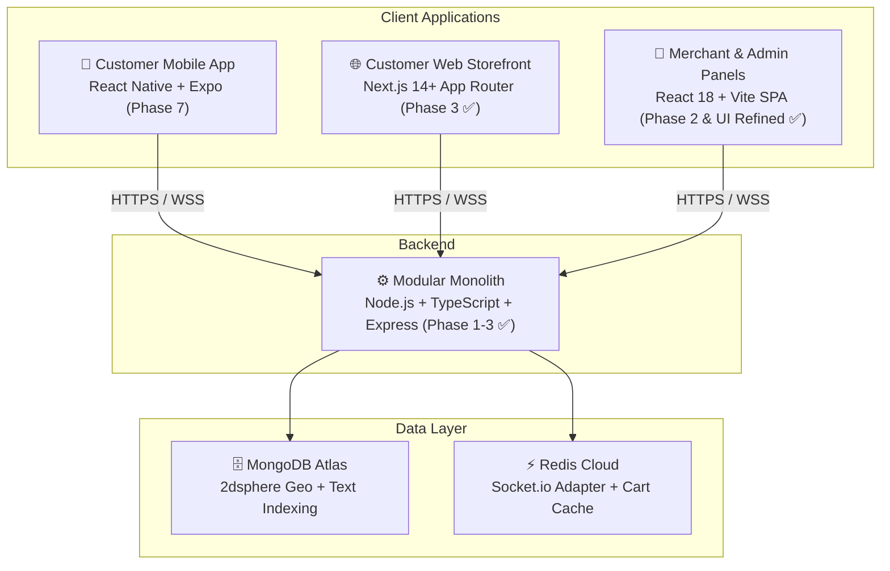

# Viztore Platform — Progress Tracker & Roadmap

## 1. Project Overview

**Viztore** is a **hyperlocal multi-vendor e-commerce platform** (3–4 km radius) designed to help **Indian local retailers** digitize their brick-and-mortar shops and make their products discoverable online.

> *"Built for Local Businesses. Made for India."*

---

## 2. System Topology

---

## 3. Current Monorepo Status

| Layer | Technology | Status | Details |
|---|---|---|---|
| **Backend API** | Node.js v20+, Express, Mongoose, TypeScript | **Live & In Sync** ✅ | Auth, Stores, Onboarding, Catalog, Orders modules; /healthz & /readyz probes active |
| **Merchant Panel** | React 18, Vite, Tailwind CSS, Zustand | **Refined** ✅ | Pixel-perfect Dashboard, 4 side drawers, 8-Tab Orders Pipeline & Product Cataloging |
| **Customer Storefront** | Next.js 14 App Router, Tailwind, TanStack Query | **Live** ✅ | Home feed, Stores directory, PLP, PDP, Category browse |
| **Shared Types** | TypeScript, Zod | **100% In Sync** ✅ | All contracts, validation schemas, DTOs (`structure.md`), branding config |
| **Real-Time & Events** | Socket.io + Redis Adapter + TypedEventBus | **Wired** ✅ | In-process domain events forwarded to Socket.io rooms with Redis distributed scaling |
| **Agent Workflows** | Custom Skills & Rules | **Active** ✅ | Fullstack Feature Workflow, UI Matching, Intern Delegation, /create-task |
| **Test Suite** | Vitest | **39/39 Passing** ✅ | 8 test suites (AppError, Auth, Stores, Onboarding, Catalog, Order Service, Order Routes, Order Repository) |
| **Build Status** | Turborepo | **Clean** ✅ | Full monorepo builds with zero errors |

---

## 4. Phase-by-Phase Roadmap & Progress

### 🔵 Phase 1 — Foundation & Core Backend (COMPLETED ✅)
> *Modular monolith architecture with authentication and spatial store queries*

- [x] Monorepo scaffolding with pnpm workspaces and Turborepo
- [x] `shared/` infrastructure (MongoDB connection, JWT, error handling, Zod validation middleware)
- [x] `auth/` module (Customer, Merchant & Admin registration, login, JWT access/refresh token pair, role guards)
- [x] `stores/` module (Store schema with MongoDB 2dsphere indexing, proximity scanning, store CRUD)
- [x] API versioning under `/api/v1`
- [x] White-label branding architecture via `branding.config.ts`

---

### 🟢 Phase 2 — Merchant Onboarding & Dashboard (COMPLETED & UI MATCHED ✅)
> *End-to-end merchant onboarding flow and pixel-perfect management dashboard*

- [x] 6-Step Merchant Onboarding API (Account, GSTIN/PAN verification, E-signature, Store setup, Business ops, Banking)
- [x] Super Admin store approval/rejection queue API
- [x] Merchant Panel frontend (React 18 + Vite SPA)
- [x] 6-Step interactive onboarding wizard UI with canvas signature and document uploads
- [x] **Merchant Operational Dashboard (Pixel-Matched to Client UI References)**:
  - Deep Navy Sidebar (`#081028`) with live counters (`Orders 25`, `Billing New`, `Wallet ₹32,450`, `Returns 7`) & "Grow your business" CTA
  - Top header with `Ctrl + K` search bar, Wallet button, Notifications count `8`, Help icon, and Seller Profile pill
  - Top 3 KPI Summary Cards: Total Sales (`₹48,750`), Orders (`128`), Visitors (`2,354`) with trending badges
  - Middle 3-Col Grid: `🔥 New Orders` card (orange button), `Sales Overview` dual-curve chart (This Week vs Last Week), `Create New Bill` card + `Order Summary` breakdown
  - Bottom 3-Col Grid: `Top Selling Products`, `Low Stock Alert` with restock triggers, `Quick Actions` 8-tile matrix
  - Footer Announcements row (3 cards with live dates and icons)
  - **4 Interactive Slide-Out Side Drawers**:
    - 🔔 `NotificationsDrawer`: Category tabs (`All`, `Orders`, `Inventory`, `System`), unread indicators, "Mark all as read"
    - ❓ `HelpSupportDrawer`: Searchable FAQ accordion (9 topics) + 24/7 Support contact card
    - 👤 `SellerProfileDrawer`: Verified seller status, business metadata, store performance metrics (`4.7 ★`, `98%`, `1,245 orders`, `₹3.2L+`), account settings
    - 📝 `ProfileInformationDrawer`: Basic info, bank details, store description, category tags, store logo editor

---

### 🟡 Phase 3 — Catalog & Customer Discovery (COMPLETED ✅)
> *Product catalog engine and customer web storefront*

- [x] `catalog/` backend module with polymorphic product schema, variants, and dynamic attributes
- [x] High-performance MongoDB aggregation faceted search engine (size, color, brand, price range, category facets)
- [x] Product CRUD with merchant store ownership checks & pre-save derived metric computation
- [x] Customer Web Storefront (`apps/web`) built on **Next.js 14 App Router**
- [x] Customer UI: Header (location pin/address selector), Footer, CategoryStrip, PromoCarousel, TrustBar, ProductCard, StoreCard, Skeletons
- [x] Home feed (`/`): "Stores Near You" horizontal rail, "Best Deals For You" product grid, explore banner
- [x] Explore Stores directory (`/stores`) with category filters and open/closed indicators
- [x] Individual Store Storefront (`/stores/[slug]`) with banner, ratings, fast delivery badge, and scoped product listing
- [x] Product Listing Page (`/products`) with URL-driven filters, faceted sidebar, sorting, pagination, and `<Suspense>` boundary
- [x] Product Detail Page (`/products/[slug]`) with image gallery, variant swatches, quantity stepper, stock validation, and specs table
- [x] Category landing pages (`/category/[slug]`)
- [x] 14 unit tests for catalog service (26 total unit tests passing)

---

### 🟠 Phase 4 — Cart, Checkout & Orders (IN PROGRESS 🔄)
> *End-to-end purchase flow, single-store cart enforcement, and enterprise order state machine*

- **Phase 4: Orders, Checkout & Delivery Module** — `100% COMPLETE`
- **Architecture Standardization: Enterprise Modular Monolith** — `100% COMPLETE`
  - Uniform 10-file Clean Architecture structure across ALL modules (`auth`, `stores`, `catalog`, `orders`).
  - Implemented `*.module.ts` (Composition Root / DI), `*.types.ts` (Domain Contracts), `*.repository.ts` (DB Decoupling), `*.validator.ts` (Zod), and `index.ts` (Public Facades).
  - Built typed `eventBus` asynchronous messaging engine (`shared/events/`).
  - 3-Tier Testing Pyramid verified: 39/39 passing unit & integration tests across 8 test suites.
  - Full monorepo build clean (`pnpm build`).

### 👥 Intern Frontend Execution Tracks
- **Abhay (Merchant Panel `apps/merchant`)**:
  - [x] **Task 1 (Dashboard + 4 Drawers)**: MERGED to `main` (`4166ed6`, `decaefc`). Pixel-matched to Harish's Home mockups with 0 brand violations.
  - [x] **Task 2 (8-Tab Orders Pipeline & Manual Create Order)**: MERGED to `main` (`297aad4`, `3f3dad4`). 8-tab status bar, order table, detail modal with printable invoice, order stepper, and manual create order flow.
  - [x] **Task 3 (Product Catalog & Add Product Wizard)**: MERGED to `main` (`cbed558`). Full 6-screen system: 5 KPI summary cards, filter toolbar, products table, 7-action popup menu, 3-step creation wizard (Category, Images, Pricing/Inventory/Storage), Preview & Submit with actual-size barcode label preview.
  - [ ] **Task 4 (Seller Registration & Onboarding)**: Assigned with 9-screen specification mapped to Harish's `1.png`–`8.png` (`abhay_seller_registration_mockup_task.md`).
- **Vinay (Customer Web Storefront `apps/web`)**:
  - [ ] **Task 1 (Mobile App Mockup ➔ Responsive Customer Web)**: Briefing & contributor guide assigned (`vinay_web_mockup_task.md`).

- [ ] Customer Web Storefront Cart Drawer & 4-step Checkout UI (`apps/web`)
- [ ] Merchant Panel Live Orders Pipeline Kanban Board (`apps/merchant`)
(Pending → Confirmed → Packed → Out for Delivery → Delivered / Cancelled)
- [ ] Secure 4-digit Delivery OTP verification for order handoff
- [ ] Real-time merchant & customer order status notifications via Socket.io

---

### 🔴 Phase 5 — Delivery, Real-Time & Notifications
> *Hyperlocal operations, dispatch engine, and real-time synchronization*

- [ ] `delivery/` backend module with WhatsApp/SMS notification triggers
- [ ] Socket.io Redis adapter for cross-instance real-time pub/sub
- [ ] Live delivery partner assignment and status polling
- [ ] Merchant audio alerts for incoming orders

---

### 🟣 Phase 6 — Account, Engagement & Polish
> *Customer profile management, order history, ratings, and merchant analytics*

- [ ] Customer account hub (saved addresses, order tracking timeline, wishlist with price drop alerts)
- [ ] Customer feedback & NPS rating system
- [ ] "Sell on Viztore" in-app merchant acquisition flow
- [ ] Merchant marketing module (in-app banner and promo campaign manager)
- [ ] Advanced revenue analytics and sales reports for merchants

---

### ⚫ Phase 7 — Mobile App & Advanced Operations
> *Customer React Native mobile app and offline retail tooling*

- [ ] Customer Mobile App with React Native & Expo (iOS + Android)
- [ ] Native GPS geolocation and background location updates
- [ ] Merchant POS/Billing terminal mode, offline inventory scanner, and expense tracker
- [ ] Automated returns, exchange, and refund settlement pipeline
